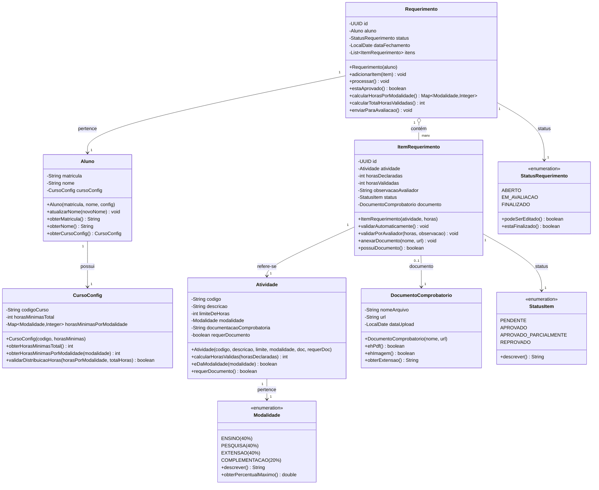
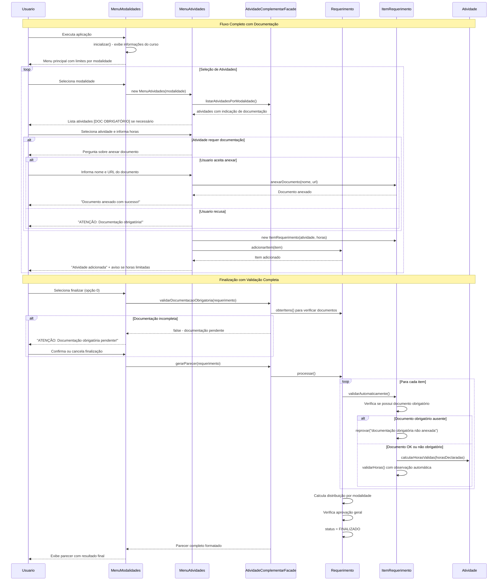
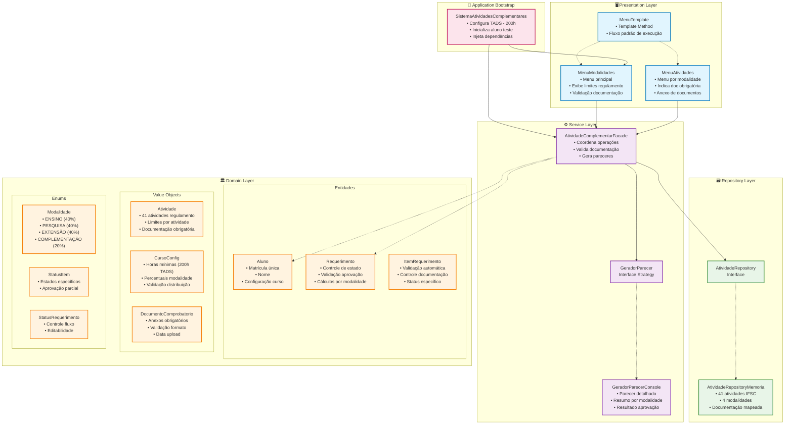

# 🎓 Sistema de Atividades Complementares - IFSC


## 📋 Apresentação do Projeto

O **Sistema de Atividades Complementares** é uma aplicação console desenvolvida em Java que permite aos estudantes do Instituto Federal de Santa Catarina (IFSC) registrar suas atividades extracurriculares e obter um parecer automatizado de validação das horas declaradas conforme o **Regulamento das Atividades Complementares** institucional.

### 🎯 Objetivo

Automatizar e padronizar o processo de validação de atividades complementares conforme o regulamento do IFSC, aplicando regras específicas de cada modalidade (limites de horas e percentuais máximos), controle de documentação obrigatória e geração de pareceres detalhados com transparência e eliminação de subjetividade no processo avaliativo.

### ✨ Funcionalidades Principais

- 📝 **Registro Conformo ao Regulamento IFSC**: Sistema estruturado pelas modalidades oficiais
  - 🎓 **Ensino**: Disciplinas extras, monitoria, semanas acadêmicas, visitas técnicas
  - 🔬 **Pesquisa e Inovação**: Iniciação científica, publicações, apresentações em eventos
  - 🤝 **Extensão**: Projetos sociais, intercâmbios, estágios não-obrigatórios
  - 💼 **Complementação**: Congressos, palestras, representação estudantil, atividades culturais

- ⚡ **Validação Automática Inteligente**: 
  - Aplicação de limites específicos por atividade (conforme regulamento)
  - Verificação de documentação obrigatória por tipo de atividade
  - Controle de percentuais máximos por modalidade (40% para Ensino/Pesquisa/Extensão, 20% Complementação)
  - Ajuste automático quando horas excedem o permitido
  - Validação de horas mínimas totais configuráveis por curso

- 📊 **Relatórios Profissionais Detalhados**: 
  - Pareceres formatados seguindo padrões institucionais do IFSC
  - Detalhamento individual por atividade com status específico
  - Resumo por modalidade com percentuais utilizados
  - Resultado final de aprovação/reprovação com justificativas
  - Alertas sobre documentação pendente

- 🔄 **Interface Intuitiva e Robusta**: 
  - Navegação hierárquica com informações de limites visíveis
  - Validação rigorosa de entrada com tratamento de erros
  - Exibição de avisos sobre documentação obrigatória
  - Visualização do requerimento em construção
  - Fluxo de trabalho guiado conforme regulamento

### 🏗️ Arquitetura do Sistema

O sistema foi desenvolvido seguindo os princípios da **Arquitetura Limpa (Clean Architecture)** de Robert C. Martin e **Domain-Driven Design (DDD)** de Eric Evans, organizando o código em camadas bem definidas:

```
📁 src/main/java/com/mycompany/atividadescomplementares/
├── 🏛️ domain/                    # Camada de Domínio (Core Business)
│   ├── Aluno.java               # Entidade Aluno com configuração do curso
│   ├── Atividade.java           # Entidade Atividade com documentação
│   ├── CursoConfig.java         # Value Object de configuração do curso
│   ├── ItemRequerimento.java    # Entidade Item com validação automática
│   ├── Requerimento.java        # Agregado principal com controle de estado
│   ├── DocumentoComprobatorio.java  # Value Object para anexos
│   ├── StatusItem.java          # Enum para status de itens
│   ├── StatusRequerimento.java  # Enum para controle de fluxo
│   └── Modalidade.java          # Enum com percentuais do regulamento
├── 🗃️ repository/               # Camada de Repositório
│   ├── AtividadeRepository.java      # Interface de acesso
│   └── AtividadeRepositoryMemoria.java  # Implementação com atividades do IFSC
├── ⚙️ service/                   # Camada de Aplicação
│   ├── AtividadeComplementarFacade.java  # Facade principal
│   ├── GeradorParecer.java              # Interface Strategy
│   └── GeradorParecerConsole.java       # Implementação console
├── 🖥️ presentation/             # Camada de Apresentação
│   ├── MenuTemplate.java        # Template Method abstrato
│   ├── MenuModalidades.java     # Menu principal com resumos
│   └── MenuAtividades.java      # Menu de atividades por modalidade
└── 🚀 SistemaAtividadesComplementares.java  # Bootstrap da aplicação
```

**Novidades da Arquitetura Atualizada:**
- 🎯 **CursoConfig**: Configuração específica por curso (TADS com 200h)
- 📋 **Atividades do Regulamento**: 41 atividades pré-cadastradas conforme regulamento IFSC
- 🔍 **Validação de Documentação**: Controle obrigatório de anexos por atividade
- 📊 **Percentuais por Modalidade**: Implementação exata dos limites regulamentares
- ✅ **Aprovação Automática**: Algoritmo completo de validação final

## 📊 Diagramas UML Atualizados

### 🏗️ Diagrama de Classes - Camada de Domínio Completa



### 🔄 Diagrama de Sequência - Fluxo com Validação de Documentação



### 🏢 Diagrama de Componentes - Arquitetura com Regulamento IFSC



## 🎯 Regras de Negócio Implementadas

### 📋 Conformidade com Regulamento IFSC

**Modalidades e Percentuais Máximos:**
- **🎓 Ensino**: Máximo 40% do total de horas
- **🔬 Pesquisa e Inovação**: Máximo 40% do total de horas  
- **🤝 Extensão**: Máximo 40% do total de horas
- **💼 Complementação**: Máximo 20% do total de horas

**Validação de Documentação:**
- ✅ **Documentos Obrigatórios**: Atividades marcadas como obrigatórias
- ✅ **Validação de Formato**: PDFs e imagens aceitos
- ✅ **Controle de Anexos**: Sistema não permite finalização sem documentos obrigatórios (com confirmação)

**Limites Específicos por Atividade:**
- 📚 **Disciplinas extras**: Até 80h
- 🔬 **Iniciação científica**: Até 60h  
- 📝 **Publicações**: Até 30h (artigos), 100h (livros)
- 🎤 **Palestras/congressos**: Até 20h
- 🏆 **Monitoria**: Até 70h

### ⚡ Algoritmo de Validação Automática

```java
// Pseudocódigo da validação
for (ItemRequerimento item : requerimento.getItens()) {
    if (item.getAtividade().requerDocumento() && !item.possuiDocumento()) {
        item.reprovar("Documentação obrigatória não anexada");
    } else {
        int horasValidas = min(item.getHorasDeclaradas(), item.getAtividade().getLimite());
        item.validarHoras(horasValidas, gerarObservacao(horasValidas));
    }
}

// Validação final de aprovação
boolean aprovado = (totalHoras >= horasMinimasExigidas) && 
                  (percentuaisPorModalidade.todos() <= limitesRegulamentares);
```

## 🚀 Instruções de Uso Atualizadas

### 📋 Pré-requisitos

- ☕ **Java 17+** (testado com Java 17)
- 💾 **16MB de memória RAM** 
- 🖥️ **Terminal com suporte UTF-8**

### 🔧 Execução Rápida

**1. Via IDE (Recomendado):**
```java
// Executar SistemaAtividadesComplementares.main()
// Aluno pré-configurado: João Silva (202500789)
// Curso: TADS com 200h mínimas
```

**2. Via Linha de Comando:**
```bash
javac -cp src src/com/mycompany/atividadescomplementares/*.java
java -cp src com.mycompany.atividadescomplementares.SistemaAtividadesComplementares
```

### 📱 Fluxo de Uso Detalhado

#### **1. Tela Inicial Atualizada**
```
=== SISTEMA DE ATIVIDADES COMPLEMENTARES - IFSC ===
Aluno: João Silva
Matrícula: 202500789
Horas mínimas exigidas: 200h

Limites por modalidade:
- Atividades de Ensino: máximo 40%
- Atividades de Pesquisa e Inovação: máximo 40%
- Atividades de Extensão: máximo 40%
- Atividades de Complementação Profissional: máximo 20%

== Menu de Modalidades ==
1) Ensino
2) Pesquisa e Inovação
3) Extensão
4) Complementação
5) Visualizar requerimento atual
0) Finalizar e emitir parecer
```

#### **2. Seleção de Atividades com Documentação**
```
-- Atividades em Ensino --
1) Disciplinas cursadas com aproveitamento, não previstas no currículo do curso                                                     (limite 80h) [DOC OBRIGATÓRIO]
2) Semana acadêmica dos cursos, quando não obrigatória                         (limite 40h) [DOC OBRIGATÓRIO]  
3) Participação em atividades de monitoria                                     (limite 70h) [DOC OBRIGATÓRIO]
4) Atividades realizadas em laboratórios e/ou oficinas do Instituto           (limite 40h) [DOC OBRIGATÓRIO]
...
0) Voltar ao menu de modalidades
Escolha a atividade (0-voltar): 3

Atividade selecionada: Participação em atividades de monitoria
Documentação necessária: Declaração de participação
Limite máximo: 70h
Horas declaradas para esta atividade: 50

Deseja anexar documento agora? (s/n): s
Nome do arquivo: declaracao_monitoria.pdf
URL do documento: /documentos/monitoria/declaracao_monitoria.pdf
Documento anexado com sucesso!
Atividade adicionada ao requerimento.
```

#### **3. Visualização do Requerimento Atual**
```
=== REQUERIMENTO ATUAL ===
1. Participação em atividades de monitoria (Atividades de Ensino) - 50h
2. Participação em programa ou projeto de pesquisa relacionados a área (Atividades de Pesquisa e Inovação) - 30h
3. Participação em congressos, jornadas, simpósios... (Atividades de Complementação Profissional) - 15h [SEM DOCUMENTO]

Total de horas declaradas: 95h
```

#### **4. Validação de Documentação na Finalização**
```
ATENÇÃO: Existem atividades que requerem documentação obrigatória!
Deseja continuar mesmo assim? (s/n): s

=== PARECER DE VALIDAÇÃO ===
Matrícula: 202500789
Nome: João Silva
Data emissão: 2025-01-15

Atividade 1:
  Descrição:       Participação em atividades de monitoria
  Modalidade:      Atividades de Ensino
  Horas declaradas: 50h
  Limite Máximo:   70h
  Horas validadas:  50h
  Status:          Aprovado
  Observação:      -- (sem ajuste)

Atividade 2:
  Descrição:       Participação em programa ou projeto de pesquisa relacionados a área
  Modalidade:      Atividades de Pesquisa e Inovação
  Horas declaradas: 30h
  Limite Máximo:   60h
  Horas validadas:  30h
  Status:          Aprovado
  Observação:      -- (sem ajuste)

Atividade 3:
  Descrição:       Participação em congressos, jornadas, simpósios, fóruns, seminários, encontros, palestras, festivais e similares
  Modalidade:      Atividades de Complementação Profissional
  Horas declaradas: 15h
  Limite Máximo:   20h
  Horas validadas:  0h
  Status:          Reprovado
  Observação:      Item reprovado: documentação comprobatória obrigatória não foi anexada

=== RESUMO POR MODALIDADE ===
Atividades de Ensino: 50h (62.5% - máx: 40%)
Atividades de Pesquisa e Inovação: 30h (37.5% - máx: 40%)
Atividades de Extensão: 0h (0.0% - máx: 40%)
Atividades de Complementação Profissional: 0h (0.0% - máx: 20%)

=== RESUMO GERAL ===
Total de horas declaradas: 95h
Total de horas validadas:  80h
Horas mínimas exigidas:    200h
RESULTADO FINAL: REPROVADO

MOTIVOS DA REPROVAÇÃO:
- Total de horas insuficiente
- Excesso de horas na modalidade Atividades de Ensino
```

## 📊 Atividades Pré-cadastradas (Regulamento IFSC)

### 🎓 Modalidade Ensino (10 atividades)
| Código | Atividade | Limite | Doc. Obrigatória |
|--------|-----------|--------|------------------|
| ENS001 | Disciplinas cursadas com aproveitamento, não previstas no currículo | 80h | ✅ Certificado |
| ENS002 | Semana acadêmica dos cursos, quando não obrigatória | 40h | ✅ Certificado |
| ENS003 | Participação em atividades de monitoria | 70h | ✅ Declaração |
| ENS004 | Atividades realizadas em laboratórios e/ou oficinas | 40h | ✅ Declaração |
| ENS005 | Visita Técnica relacionada à área | 40h | ✅ Declaração |
| ENS006 | Participação em cursos de qualificação na área afim | 80h | ✅ Certificado |
| ENS007 | Participação como ouvintes em bancas de projetos integradores | 20h | ✅ Documento da banca |
| ENS008 | Participação como ouvintes em bancas de TCC, dissertações ou teses | 20h | ✅ Documento da banca |
| ENS009 | Desenvolvimento de material didático ou instrucional | 30h | ✅ Declaração |
| ENS010 | Instrutor de cursos abertos à comunidade | 70h | ✅ Declaração |

### 🔬 Modalidade Pesquisa e Inovação (12 atividades)
| Código | Atividade | Limite | Doc. Obrigatória |
|--------|-----------|--------|------------------|
| PES001 | Participação em programa ou projeto de pesquisa | 60h | ✅ Declaração |
| PES002 | Apresentação de projeto de pesquisa | 20h | ✅ Declaração |
| PES003 | Autoria e coautoria em artigo publicado em Periódico | 30h | ✅ Capa do artigo |
| PES004 | Livro na área afim | 100h | ✅ Ficha catalográfica |
| PES005 | Capítulo de livro na área afim | 30h | ✅ Ficha catalográfica |
| PES006 | Publicação em Anais de Evento Técnico Científico | 30h | ✅ Cópia do artigo |
| PES007 | Apresentação de trabalho em Evento Técnico Científico | 20h | ✅ Certificado |
| PES008 | Participação de Programa de Iniciação Científica | 60h | ✅ Declaração |
| PES009 | Participação como palestrante, conferencista, ministrante | 60h | ✅ Certificado |
| PES010 | Prêmios concedidos por instituições acadêmicas | 60h | ✅ Declaração |
| PES011 | Participação na criação de Produto ou Processo Tecnológico | 200h | ✅ Registro propriedade |
| PES012 | Participação em grupo de pesquisa na área | 60h | ✅ Declaração do líder |

### 🤝 Modalidade Extensão (7 atividades)
| Código | Atividade | Limite | Doc. Obrigatória |
|--------|-----------|--------|------------------|
| EXT001 | Participação em programa ou projeto de extensão | 60h | ✅ Declaração |
| EXT002 | Apresentação de projeto de extensão | 20h | ✅ Declaração |
| EXT003 | Participação em ações sociais cívicas e comunitárias | 40h | ✅ Declaração |
| EXT004 | Texto em jornal ou revista da área | 40h | ✅ Texto |
| EXT005 | Intercâmbio com instituições no Brasil ou exterior | 100h | ✅ Declaração |
| EXT006 | Estágio não-obrigatório na área do curso | 100h | ✅ Declaração do empregador |
| EXT007 | Exercício profissional com vínculo empregatício | 100h | ✅ Declaração ou Carteira |

### 💼 Modalidade Complementação (11 atividades)
| Código | Atividade | Limite | Doc. Obrigatória |
|--------|-----------|--------|------------------|
| COM001 | Participação em congressos, jornadas, simpósios, palestras | 20h | ✅ Declaração |
| COM002 | Comissão organizadora de congressos, jornadas, simpósios | 20h | ✅ Declaração |
| COM003 | Premiação em eventos relacionados ao curso | 30h | ✅ Declaração |
| COM004 | Curso de língua estrangeira | 80h | ✅ Certificado |
| COM005 | Premiação em atividades esportivas como representante IFSC | 60h | ✅ Declaração |
| COM006 | Representação estudantil em colegiado, grêmio, centro acadêmico | 40h | ✅ Declaração |
| COM007 | Representação de turma (inclui participação em conselhos de classe) | 30h | ✅ Declaração do Coordenador |
| COM008 | Participação em Empresa Júnior | 40h | ✅ Declaração do dirigente |
| COM009 | Classificação em concursos culturais | 20h | ✅ Certificado ou resultado |
| COM010 | Participação em projetos sociais, trabalho voluntário | 20h | ✅ Declaração do responsável |
| COM011 | Atividades socioculturais, artísticas e esportivas | 20h | ✅ Declaração do responsável |

## 🎨 Princípios de Design e Padrões Implementados

### 🏛️ **Domain-Driven Design (DDD) Aplicado**

**Modelagem Rica do Domínio:**
```java
// Entidade Rica - Requerimento com comportamentos específicos
public class Requerimento {
    public boolean estaAprovado() {
        CursoConfig config = this.aluno.obterCursoConfig();
        Map<Modalidade, Integer> horasPorModalidade = calcularHorasPorModalidade();
        int totalHoras = calcularTotalHorasValidadas();
        
        // Regra de negócio: validação completa conforme regulamento
        return config.validarDistribuicaoHoras(horasPorModalidade, totalHoras);
    }
    
    public Map<Modalidade, Integer> calcularHorasPorModalidade() {
        // Lógica específica para agrupar horas por modalidade
        Map<Modalidade, Integer> resultado = new HashMap<>();
        for (Modalidade modalidade : Modalidade.values()) {
            int horas = this.itens.stream()
                    .filter(item -> item.obterAtividade().eDaModalidade(modalidade))
                    .mapToInt(ItemRequerimento::obterHorasValidadas)
                    .sum();
            resultado.put(modalidade, horas);
        }
        return resultado;
    }
}
```

**Value Objects Imutáveis:**
```java
// CursoConfig - configuração específica por curso
public class CursoConfig {
    private final String codigoCurso;
    private final int horasMinimasTotal;
    private final Map<Modalidade, Integer> horasMinimasPorModalidade;
    
    public boolean validarDistribuicaoHoras(Map<Modalidade, Integer> horasPorModalidade, int totalHoras) {
        // Regra complexa: validação de percentuais por modalidade
        for (Map.Entry<Modalidade, Integer> entry : horasPorModalidade.entrySet()) {
            Modalidade modalidade = entry.getKey();
            Integer horas = entry.getValue();
            
            double percentualAtual = (double) horas / totalHoras;
            if (percentualAtual > modalidade.obterPercentualMaximo()) {
                return false; // Excedeu limite da modalidade
            }
        }
        return totalHoras >= horasMinimasTotal;
    }
}
```

**Linguagem Ubíqua Respeitada:**
- ✅ **Requerimento** (não "Pedido" ou "Solicitação")
- ✅ **Modalidades** (Ensino, Pesquisa, Extensão, Complementação)
- ✅ **Horas Validadas** vs **Horas Declaradas**
- ✅ **Documentação Comprobatória** (termo do regulamento)
- ✅ **Parecer de Validação** (documento oficial)

### 🔄 **Strategy Pattern para Geração de Pareceres**

```java
// Interface estratégica flexível
public interface GeradorParecer {
    String gerarParecer(Requerimento requerimento);
}

// Implementação atual - Console detalhado
public class GeradorParecerConsole implements GeradorParecer {
    @Override
    public String gerarParecer(Requerimento requerimento) {
        StringBuilder parecer = new StringBuilder();
        
        // Cabeçalho oficial
        parecer.append("=== PARECER DE VALIDAÇÃO ===\n");
        
        // Detalhamento por atividade
        List<ItemRequerimento> itens = requerimento.obterItens();
        for (int i = 0; i < itens.size(); i++) {
            ItemRequerimento item = itens.get(i);
            parecer.append(formatarItem(item, i + 1));
        }
        
        // Resumo por modalidade com percentuais
        parecer.append(formatarResumoModalidades(requerimento));
        
        // Resultado final com justificativas
        parecer.append(formatarResultadoFinal(requerimento));
        
        return parecer.toString();
    }
    
    private String formatarResumoModalidades(Requerimento requerimento) {
        StringBuilder resumo = new StringBuilder();
        resumo.append("=== RESUMO POR MODALIDADE ===\n");
        
        Map<Modalidade, Integer> horasPorModalidade = requerimento.calcularHorasPorModalidade();
        int totalHoras = requerimento.calcularTotalHorasValidadas();
        
        for (Modalidade modalidade : Modalidade.values()) {
            int horas = horasPorModalidade.getOrDefault(modalidade, 0);
            double percentual = totalHoras > 0 ? (double) horas / totalHoras * 100 : 0;
            double percentualMaximo = modalidade.obterPercentualMaximo() * 100;
            
            resumo.append(String.format("%s: %dh (%.1f%% - máx: %.0f%%)\n",
                    modalidade.descrever(), horas, percentual, percentualMaximo));
        }
        
        return resumo.toString();
    }
}

// Futuras implementações sem modificar código existente
public class GeradorParecerPDF implements GeradorParecer {
    @Override
    public String gerarParecer(Requerimento requerimento) {
        // Usar bibliotecas como iText ou Apache PDFBox
        // Gerar PDF oficial com formatação institucional
        return "parecer_" + requerimento.obterAluno().obterMatricula() + ".pdf";
    }
}

public class GeradorParecerHTML implements GeradorParecer {
    @Override
    public String gerarParecer(Requerimento requerimento) {
        // Gerar HTML responsivo para visualização web
        // Com gráficos e interatividade
        return "<html>...</html>";
    }
}
```

### 🗃️ **Repository Pattern com Dados Reais**

```java
// Implementação com todas as atividades do regulamento IFSC
public class AtividadeRepositoryMemoria implements AtividadeRepository {
    private final Map<String, Atividade> atividades = new HashMap<>();

    public AtividadeRepositoryMemoria() {
        inicializarAtividadesRegulamento();
    }

    private void inicializarAtividadesRegulamento() {
        // Modalidade ENSINO - 10 atividades
        adicionarAtividadesEnsino();
        
        // Modalidade PESQUISA - 12 atividades  
        adicionarAtividadesPesquisa();
        
        // Modalidade EXTENSAO - 7 atividades
        adicionarAtividadesExtensao();
        
        // Modalidade COMPLEMENTACAO - 11 atividades
        adicionarAtividadesComplementacao();
    }
    
    private void adicionarAtividadesEnsino() {
        // Exemplos de atividades reais do regulamento
        atividades.put("ENS001", new Atividade(
            "ENS001", 
            "Disciplinas cursadas com aproveitamento, não previstas no currículo do curso", 
            80, 
            Modalidade.ENSINO, 
            "Certificado ou declaração de conclusão", 
            true // Documentação obrigatória
        ));
        
        atividades.put("ENS003", new Atividade(
            "ENS003", 
            "Participação em atividades de monitoria", 
            70, 
            Modalidade.ENSINO, 
            "Declaração de participação", 
            true
        ));
        // ... mais atividades
    }
}

// Flexibilidade para futuras implementações
public class AtividadeRepositoryAPI implements AtividadeRepository {
    private final String baseUrl;
    
    @Override
    public List<Atividade> buscarPorModalidade(Modalidade modalidade) {
        // Buscar atividades via API REST
        // Permite atualizações dinâmicas do regulamento
        return httpClient.get(baseUrl + "/atividades?modalidade=" + modalidade.name());
    }
}
```

### 📋 **Template Method Pattern Refinado**

```java
public abstract class MenuTemplate {
    // Template method - estrutura invariável
    public final void executar() {
        inicializar();           // Configuração específica
        while (deveExecutar()) { // Condição de parada específica
            exibirOpcoes();      // Interface específica
            int opcao = lerOpcao();  // Entrada padronizada
            processarOpcao(opcao);   // Lógica específica
        }
        finalizar();             // Limpeza específica
    }
    
    // Pontos de extensão bem definidos
    protected abstract void inicializar();
    protected abstract boolean deveExecutar();
    protected abstract void exibirOpcoes();
    protected abstract void processarOpcao(int opcao);
    
    // Comportamento padrão reutilizável
    protected int lerOpcao() {
        while (!scanner.hasNextInt()) {
            System.out.print("Por favor, digite um número válido: ");
            scanner.next();
        }
        return scanner.nextInt();
    }
    
    protected void finalizar() {
        // Comportamento padrão: nada a fazer
    }
}

// Implementação específica - Menu com informações do regulamento
public class MenuModalidades extends MenuTemplate {
    @Override
    protected void inicializar() {
        System.out.println("=== SISTEMA DE ATIVIDADES COMPLEMENTARES - IFSC ===");
        System.out.println("Aluno: " + requerimento.obterAluno().obterNome());
        System.out.println("Matrícula: " + requerimento.obterAluno().obterMatricula());
        System.out.println("Horas mínimas exigidas: " + 
            requerimento.obterAluno().obterCursoConfig().obterHorasMinimasTotal() + "h");
        exibirLimitesModalidade();
    }
    
    private void exibirLimitesModalidade() {
        System.out.println("\nLimites por modalidade:");
        for (Modalidade modalidade : Modalidade.values()) {
            System.out.printf("- %s: máximo %.0f%%\n",
                    modalidade.descrever(),
                    modalidade.obterPercentualMaximo() * 100);
        }
    }
}
```

### 🏢 **Facade Pattern para Operações Complexas**

```java
public class AtividadeComplementarFacade {
    private final AtividadeRepository atividadeRepository;
    private final GeradorParecer geradorParecer;
    
    // Operação complexa: validação completa de documentação
    public boolean validarDocumentacaoObrigatoria(Requerimento requerimento) {
        return requerimento.obterItens().stream()
                .filter(item -> item.obterAtividade().requerDocumento()) // Apenas obrigatórias
                .allMatch(ItemRequerimento::possuiDocumento);           // Todas devem ter documento
    }
    
    // Operação complexa: geração de parecer com processamento automático
    public String gerarParecer(Requerimento requerimento) {
        // 1. Verifica se já foi processado
        if (!requerimento.obterStatus().estaFinalizado()) {
            // 2. Processa automaticamente todos os itens
            requerimento.processar();
        }
        
        // 3. Gera parecer usando estratégia configurada
        return geradorParecer.gerarParecer(requerimento);
    }
    
    // Interface simplificada para busca
    public List<Atividade> listarAtividadesPorModalidade(Modalidade modalidade) {
        return atividadeRepository.buscarPorModalidade(modalidade);
    }
}
```

### 💎 **SOLID Principles Implementados**

#### **Single Responsibility - Responsabilidades Bem Definidas**

```java
// ✅ APENAS validação automática de itens
public class ItemRequerimento {
    public void validarAutomaticamente() {
        if (this.atividade.requerDocumento() && !possuiDocumento()) {
            reprovar("Item reprovado: documentação comprobatória obrigatória não foi anexada");
            return;
        }
        
        int horasCalculadas = this.atividade.calcularHorasValidas(this.horasDeclaradas);
        String observacao = gerarObservacaoAutomatica(horasCalculadas);
        validarHoras(horasCalculadas, observacao);
    }
}

// ✅ APENAS configuração específica de curso
public class CursoConfig {
    public boolean validarDistribuicaoHoras(Map<Modalidade, Integer> horasPorModalidade, int totalHoras) {
        // Lógica específica de validação por curso
    }
}

// ✅ APENAS geração de pareceres formatados
public class GeradorParecerConsole implements GeradorParecer {
    public String gerarParecer(Requerimento requerimento) {
        // Apenas formatação e apresentação
    }
}
```

#### **Open/Closed - Extensão sem Modificação**

```java
// ✅ Sistema aberto para novos tipos de gerador
interface GeradorParecer {
    String gerarParecer(Requerimento requerimento);
}

// ✅ Novas implementações sem alterar código existente
class GeradorParecerEmail implements GeradorParecer { ... }
class GeradorParecerXML implements GeradorParecer { ... }
class GeradorParecerJSON implements GeradorParecer { ... }

// ✅ Sistema aberto para novos repositórios  
interface AtividadeRepository {
    List<Atividade> buscarPorModalidade(Modalidade modalidade);
}

class AtividadeRepositoryBancoDados implements AtividadeRepository { ... }
class AtividadeRepositoryWebService implements AtividadeRepository { ... }
```

#### **Dependency Inversion - Inversão Completa**

```java
// ✅ Módulo de alto nível depende apenas de abstrações
public class AtividadeComplementarFacade {
    private final AtividadeRepository repository;     // Abstração
    private final GeradorParecer geradorParecer;     // Abstração
    
    // ✅ Inversão por injeção de dependência
    public AtividadeComplementarFacade(AtividadeRepository repository, GeradorParecer gerador) {
        this.repository = repository;
        this.geradorParecer = gerador;
    }
}

// ✅ Configuração no ponto mais alto (main)
public static void main(String[] args) {
    // Implementações concretas criadas no bootstrap
    AtividadeRepository repository = new AtividadeRepositoryMemoria();
    GeradorParecer gerador = new GeradorParecerConsole();
    
    // Injeção manual (em produção: Spring IoC, Guice, etc.)
    AtividadeComplementarFacade facade = 
        new AtividadeComplementarFacade(repository, gerador);
        
    // Sistema configurado e pronto
    CursoConfig cursoConfig = new CursoConfig("TADS", 200);
    Aluno aluno = new Aluno("202500789", "João Silva", cursoConfig);
    Requerimento requerimento = new Requerimento(aluno);
    
    new MenuModalidades(scanner, facade, requerimento).executar();
}
```
