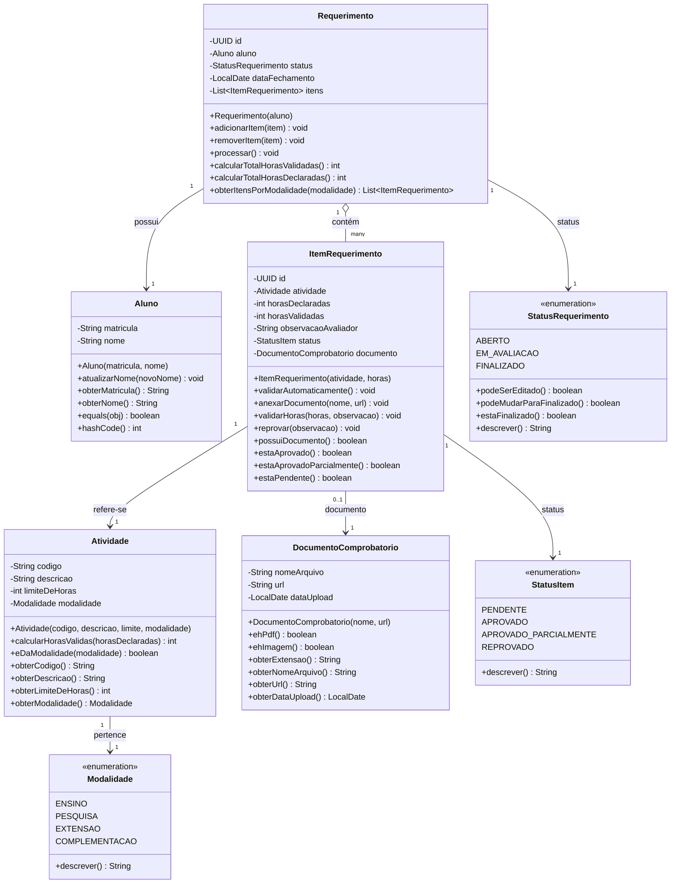
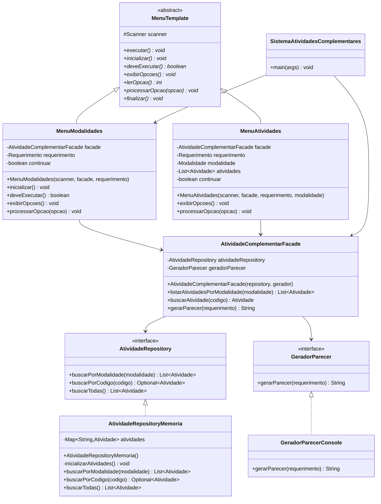
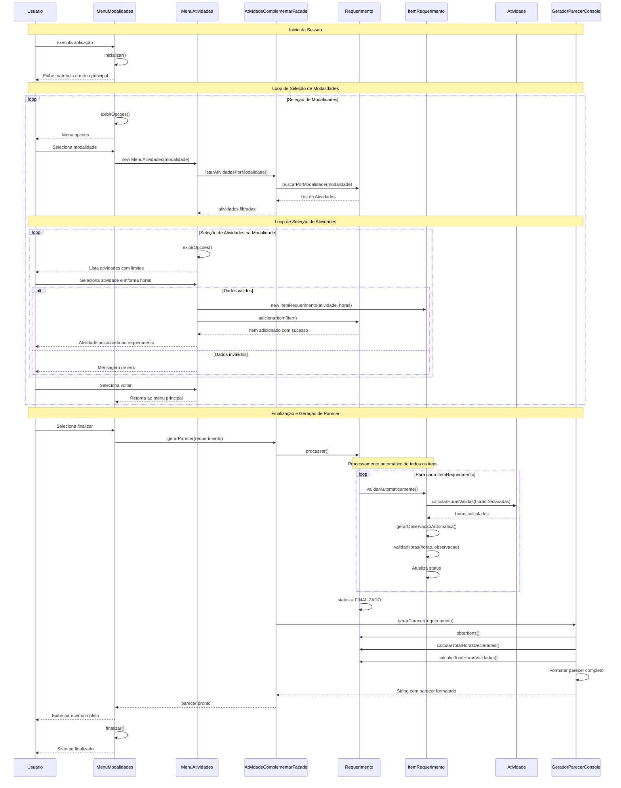
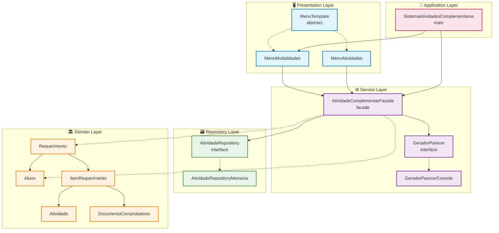
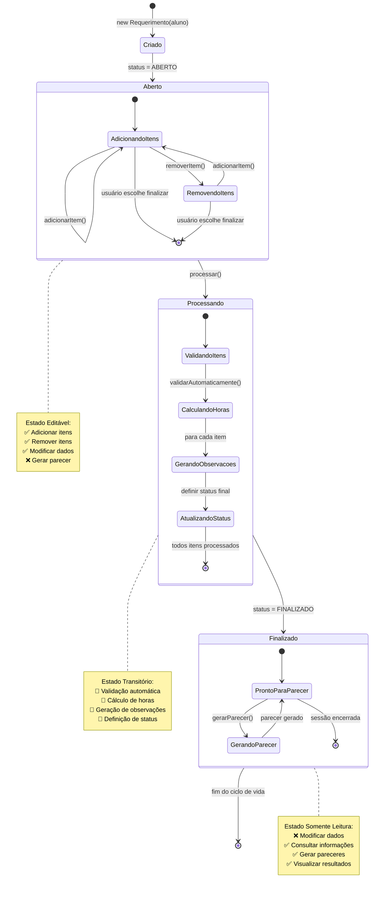

# 🎓 Sistema de Atividades Complementares


## 📋 Apresentação do Projeto

O **Sistema de Atividades Complementares** é uma aplicação console desenvolvida em Java que permite aos estudantes universitários registrar suas atividades extracurriculares e obter um parecer automatizado de validação das horas declaradas conforme as normas acadêmicas institucionais.

### 🎯 Objetivo

Automatizar e padronizar o processo de validação de atividades complementares em instituições de ensino superior, aplicando regras de negócio específicas para cada modalidade de atividade e gerando pareceres detalhados com as horas efetivamente validadas, eliminando subjetividade e garantindo transparência no processo.

### ✨ Funcionalidades Principais

- 📝 **Registro Organizado de Atividades**: Sistema estruturado por modalidades acadêmicas
  - 🎓 **Ensino**: Monitoria, aulas de reforço, tutoria
  - 🔬 **Pesquisa**: Iniciação científica, publicações, congressos
  - 🤝 **Extensão**: Projetos sociais, cursos comunitários, voluntariado
  - 💼 **Complementação**: Palestras técnicas, visitas, workshops

- ⚡ **Validação Automática e Inteligente**: 
  - Aplicação de limites máximos por tipo de atividade
  - Ajuste automático quando horas excedem o permitido
  - Geração de observações explicativas detalhadas
  - Prevenção de fraudes e inconsistências

- 📊 **Relatórios Profissionais**: 
  - Pareceres formatados seguindo padrões institucionais
  - Detalhamento por atividade individual
  - Resumo executivo com totalizações
  - Observações técnicas para cada validação

- 🔄 **Interface Intuitiva e Robusta**: 
  - Navegação hierárquica clara e lógica
  - Validação rigorosa de entrada do usuário
  - Tratamento de erros com mensagens informativas
  - Fluxo de trabalho guiado passo a passo

### 🏗️ Arquitetura do Sistema

O sistema foi desenvolvido seguindo os princípios da **Arquitetura Limpa (Clean Architecture)** de Robert C. Martin e **Domain-Driven Design (DDD)** de Eric Evans, organizando o código em camadas bem definidas com responsabilidades específicas e baixo acoplamento:

```
📁 src/main/java/com/mycompany/atividadescomplementares/
├── 🏛️ domain/                    # Camada de Domínio (Core Business)
│   ├── Aluno.java               # Entidade Aluno
│   ├── Atividade.java           # Entidade Atividade  
│   ├── ItemRequerimento.java    # Entidade Item de Requerimento
│   ├── Requerimento.java        # Agregado Requerimento
│   ├── DocumentoComprobatorio.java  # Value Object
│   ├── StatusItem.java          # Enum com comportamentos
│   ├── StatusRequerimento.java  # Enum com regras de transição
│   └── Modalidade.java          # Enum de classificação
├── 🗃️ repository/               # Camada de Repositório
│   ├── AtividadeRepository.java      # Interface de acesso
│   └── AtividadeRepositoryMemoria.java  # Implementação em memória
├── ⚙️ service/                   # Camada de Aplicação
│   ├── AtividadeComplementarFacade.java  # Facade principal
│   ├── GeradorParecer.java              # Interface Strategy
│   └── GeradorParecerConsole.java       # Implementação console
├── 🖥️ presentation/             # Camada de Apresentação
│   ├── MenuTemplate.java        # Template Method abstrato
│   ├── MenuModalidades.java     # Menu principal
│   └── MenuAtividades.java      # Menu de atividades
└── 🚀 SistemaAtividadesComplementares.java  # Bootstrap da aplicação
```

**Benefícios da Arquitetura Adotada:**
- 🎯 **Separação Clara de Responsabilidades**: Cada camada tem um propósito específico
- 🔄 **Baixo Acoplamento**: Mudanças em uma camada não afetam as outras
- 🧪 **Alta Testabilidade**: Componentes podem ser testados isoladamente
- 📈 **Facilidade de Extensão**: Novos recursos podem ser adicionados sem modificar código existente
- 🛡️ **Proteção do Domínio**: Regras de negócio protegidas de mudanças externas

## 📊 Diagramas UML e Descrições

### 🏗️ Diagrama de Classes - Camada de Domínio

Este diagrama representa o núcleo do sistema, mostrando as entidades principais e seus relacionamentos:



**Descrição dos Componentes Principais:**

- **🎓 Aluno**: Entidade que representa o estudante, identificado unicamente pela matrícula
- **📋 Atividade**: Value Object imutável que define tipos de atividades com limites específicos
- **📄 Requerimento**: Agregado principal que coordena todo o processo de validação
- **📌 ItemRequerimento**: Entidade que representa cada atividade individual declarada
- **📎 DocumentoComprobatorio**: Value Object para anexos de comprovação
- **🏷️ StatusItem/StatusRequerimento**: Enums que controlam os estados do sistema
- **🗂️ Modalidade**: Classificação das atividades por área acadêmica

### 🏛️ Diagrama de Classes - Arquitetura Completa

Este diagrama mostra como todas as camadas se integram:



**Análise das Responsabilidades por Camada:**

- **🖥️ Presentation**: Gerencia interação com usuário e fluxo de navegação
- **⚙️ Service**: Coordena operações complexas e implementa casos de uso
- **🗃️ Repository**: Abstrai acesso e persistência de dados
- **🏛️ Domain**: Contém regras de negócio e lógica central (não mostrado aqui para simplificar)

### 🔄 Diagrama de Sequência - Fluxo Principal de Uso

Este diagrama ilustra a interação completa durante uma sessão típica:



**Fluxos de Erro Importantes:**
- ❌ **Entrada inválida**: Sistema solicita nova entrada
- ❌ **Horas negativas**: Rejeição com mensagem explicativa  
- ❌ **Requerimento vazio**: Não permite finalização
- ❌ **Atividade não encontrada**: Tratamento de exceção

### 🏢 Diagrama de Arquitetura - Visão de Componentes



**Princípios Arquiteturais Aplicados:**
- 🎯 **Dependency Rule**: Dependências apontam sempre para o centro (domínio)
- 🔄 **Inversão de Controle**: Interfaces definem contratos, implementações são injetadas
- 🛡️ **Isolamento do Domínio**: Core business isolado de frameworks e infraestrutura
- 📦 **Single Responsibility**: Cada componente tem uma responsabilidade clara

### 📋 Diagrama de Estados - Ciclo de Vida do Requerimento



**Estados e Transições Detalhadas:**
- **🆕 Criado**: Estado inicial após instanciação
- **📝 Aberto**: Permite edição e modificação de itens
- **⚙️ Processando**: Executa validação automática de todos os itens
- **✅ Finalizado**: Estado final, apenas consulta e geração de pareceres

## 🎨 Princípios de Design e Padrões de Projeto

### 🏛️ **Domain-Driven Design (DDD)**

**Justificativa**: O domínio de atividades complementares possui regras de negócio complexas e específicas que devem ser centralizadas e protegidas. O DDD garante que essa complexidade seja adequadamente modelada e encapsulada.

**Implementação Detalhada:**

```java
// Entidade Rica - ItemRequerimento
public class ItemRequerimento {
    // Comportamento central do domínio
    public void validarAutomaticamente() {
        int horasCalculadas = this.atividade.calcularHorasValidas(this.horasDeclaradas);
        String observacao = gerarObservacaoAutomatica(horasCalculadas);
        validarHoras(horasCalculadas, observacao);
    }
    
    // Lógica de negócio encapsulada
    private String gerarObservacaoAutomatica(int horasCalculadas) {
        if (horasCalculadas < this.horasDeclaradas) {
            return String.format("Horas declaradas (%dh) excedem o limite (%dh); ajustadas para %dh.",
                    this.horasDeclaradas, this.atividade.obterLimiteDeHoras(), horasCalculadas);
        }
        return "-- (sem ajuste)";
    }
    
    // Invariantes protegidas
    public void validarHoras(int horasValidadas, String observacao) {
        if (horasValidadas < 0) {
            throw new IllegalArgumentException("Horas validadas não podem ser negativas");
        }
        // ... mais validações e lógica de negócio
    }
}
```

**Conceitos DDD Aplicados:**
- **🏗️ Entities**: Aluno, ItemRequerimento (identidade única)
- **💎 Value Objects**: DocumentoComprobatorio, Atividade (imutáveis)
- **📦 Aggregates**: Requerimento (raiz de agregação)
- **🏷️ Domain Services**: Validação automática de regras complexas
- **🗣️ Ubiquitous Language**: Terminologia do domínio acadêmico respeitada

**Benefícios Obtidos:**
- ✅ **Proteção de Invariantes**: Regras sempre respeitadas
- ✅ **Encapsulamento**: Lógica concentrada onde pertence
- ✅ **Linguagem Clara**: Código reflete o domínio real
- ✅ **Evolução Controlada**: Mudanças nas regras centralizadas

### 🗃️ **Repository Pattern**

**Justificativa**: Abstrai completamente o mecanismo de persistência, permitindo diferentes implementações (memória, banco de dados, arquivos, APIs externas) sem impactar as regras de negócio ou lógica de aplicação.

```java
// Contrato bem definido
public interface AtividadeRepository {
    List<Atividade> buscarPorModalidade(Modalidade modalidade);
    Optional<Atividade> buscarPorCodigo(String codigo);
    List<Atividade> buscarTodas();
}

// Implementação atual (memória)
public class AtividadeRepositoryMemoria implements AtividadeRepository {
    private final Map<String, Atividade> atividades = new HashMap<>();
    
    @Override
    public List<Atividade> buscarPorModalidade(Modalidade modalidade) {
        return atividades.values().stream()
                .filter(atividade -> atividade.eDaModalidade(modalidade))
                .collect(Collectors.toList());
    }
}

// Futuras implementações possíveis
// class AtividadeRepositoryJPA implements AtividadeRepository
// class AtividadeRepositoryMongoDB implements AtividadeRepository  
// class AtividadeRepositoryAPI implements AtividadeRepository
```

### 🎭 **Strategy Pattern**

**Justificativa**: O sistema precisa gerar pareceres em diferentes formatos. O Strategy permite adicionar novos formatos sem modificar código existente, seguindo o princípio Open/Closed.

```java
// Interface estratégica
public interface GeradorParecer {
    String gerarParecer(Requerimento requerimento);
}

// Estratégia atual - Console
public class GeradorParecerConsole implements GeradorParecer {
    @Override
    public String gerarParecer(Requerimento requerimento) {
        StringBuilder parecer = new StringBuilder();
        parecer.append("=== PARECER DE VALIDAÇÃO ===\n");
        // ... formatação específica para console
        return parecer.toString();
    }
}

// Futuras estratégias sem modificar código existente
public class GeradorParecerPDF implements GeradorParecer {
    @Override
    public String gerarParecer(Requerimento requerimento) {
        // Usar iText ou Apache PDFBox
        return "caminho/para/arquivo.pdf";
    }
}

public class GeradorParecerEmail implements GeradorParecer {
    @Override  
    public String gerarParecer(Requerimento requerimento) {
        // Usar JavaMail API
        return "Email enviado para: " + requerimento.obterAluno().obterMatricula();
    }
}
```

### 🏢 **Facade Pattern**

**Justificativa**: A coordenação entre repository, geração de pareceres e processamento de requerimentos é complexa. O Facade simplifica essas operações em uma interface coesa e intuitiva.

```java
public class AtividadeComplementarFacade {
    private final AtividadeRepository atividadeRepository;
    private final GeradorParecer geradorParecer;
    
    public AtividadeComplementarFacade(AtividadeRepository repository, GeradorParecer gerador) {
        this.atividadeRepository = repository;
        this.geradorParecer = gerador;
    }
    
    // Operação complexa simplificada
    public String gerarParecer(Requerimento requerimento) {
        // 1. Verifica estado do requerimento
        if (!requerimento.obterStatus().estaFinalizado()) {
            // 2. Processa automaticamente se necessário
            requerimento.processar();
        }
        // 3. Gera parecer usando estratégia configurada
        return geradorParecer.gerarParecer(requerimento);
    }
    
    // Interface simplificada para busca
    public List<Atividade> listarAtividadesPorModalidade(Modalidade modalidade) {
        return atividadeRepository.buscarPorModalidade(modalidade);
    }
}
```

### 📋 **Template Method Pattern**

**Justificativa**: Todos os menus compartilham a mesma estrutura de execução (inicializar → loop → finalizar), mas diferem nos detalhes específicos. O Template Method elimina duplicação e garante consistência.

```java
public abstract class MenuTemplate {
    // Template method - estrutura imutável
    public final void executar() {
        inicializar();
        while (deveExecutar()) {
            exibirOpcoes();
            int opcao = lerOpcao();
            processarOpcao(opcao);
        }
        finalizar();
    }
    
    // Pontos de variação para subclasses
    protected abstract void inicializar();
    protected abstract boolean deveExecutar();
    protected abstract void exibirOpcoes();
    protected abstract int lerOpcao();
    protected abstract void processarOpcao(int opcao);
    protected abstract void finalizar();
}

// Implementação específica - Menu de Modalidades
public class MenuModalidades extends MenuTemplate {
    @Override
    protected void exibirOpcoes() {
        System.out.println("== Menu de Modalidades ==");
        System.out.println("1) Ensino");
        System.out.println("2) Pesquisa");
        // ... outras opções
    }
    
    @Override
    protected void processarOpcao(int opcao) {
        switch (opcao) {
            case 1 -> new MenuAtividades(scanner, facade, requerimento, ENSINO).executar();
            // ... outros casos
        }
    }
}
```

### 💎 **Princípios SOLID Aplicados**

#### **S - Single Responsibility Principle (Responsabilidade Única)**

Cada classe possui uma única razão para existir e mudar:

```java
// ✅ Responsabilidade: Gerar pareceres em formato console
public class GeradorParecerConsole implements GeradorParecer {
    @Override
    public String gerarParecer(Requerimento requerimento) {
        // Única responsabilidade: formatação console
    }
}

// ✅ Responsabilidade: Armazenar e recuperar atividades
public class AtividadeRepositoryMemoria implements AtividadeRepository {
    // Única responsabilidade: persistência em memória
}

// ✅ Responsabilidade: Representar um estudante
public class Aluno {
    // Única responsabilidade: dados e comportamentos do aluno
}
```

#### **O - Open/Closed Principle (Aberto/Fechado)**

Sistema aberto para extensão, fechado para modificação:

```java
// ✅ Extensível sem modificação
interface GeradorParecer {
    String gerarParecer(Requerimento requerimento);
}

// ✅ Nova funcionalidade sem alterar código existente
class GeradorParecerPDF implements GeradorParecer { ... }
class GeradorParecerEmail implements GeradorParecer { ... }

// ✅ Cliente permanece inalterado
AtividadeComplementarFacade facade = new AtividadeComplementarFacade(
    repository, 
    new GeradorParecerPDF() // Troca transparente
);
```

#### **L - Liskov Substitution Principle (Substituição de Liskov)**

Subtipos são perfeitamente substituíveis pelos tipos base:

```java
// ✅ Qualquer implementação funciona identicamente
AtividadeRepository repo1 = new AtividadeRepositoryMemoria();
AtividadeRepository repo2 = new AtividadeRepositoryJPA(); // futuro
AtividadeRepository repo3 = new AtividadeRepositoryFile(); // futuro

// ✅ Facade funciona com qualquer implementação
AtividadeComplementarFacade facade = new AtividadeComplementarFacade(
    repo1, // ou repo2, ou repo3
    geradorParecer
);

// ✅ Comportamento idêntico garantido
List<Atividade> atividades = facade.listarAtividadesPorModalidade(ENSINO);
```

#### **I - Interface Segregation Principle (Segregação de Interface)**

Interfaces específicas e focadas, sem métodos desnecessários:

```java
// ✅ Interface focada apenas em atividades
interface AtividadeRepository {
    List<Atividade> buscarPorModalidade(Modalidade modalidade);
    Optional<Atividade> buscarPorCodigo(String codigo);
    List<Atividade> buscarTodas();
    // Não possui métodos de outros domínios
}

// ✅ Interface focada apenas em geração de pareceres
interface GeradorParecer {
    String gerarParecer(Requerimento requerimento);
    // Não possui métodos de persistência ou validação
}
```

#### **D - Dependency Inversion Principle (Inversão de Dependência)**

Módulos de alto nível não dependem de módulos de baixo nível. Ambos dependem de abstrações:

```java
// ✅ Facade depende de abstrações, não implementações
public class AtividadeComplementarFacade {
    private final AtividadeRepository atividadeRepository;    // Interface
    private final GeradorParecer geradorParecer;            // Interface
    
    // ✅ Inversão através de injeção de dependência
    public AtividadeComplementarFacade(
        AtividadeRepository repository,  // Abstração injetada
        GeradorParecer gerador          // Abstração injetada
    ) {
        this.atividadeRepository = repository;
        this.geradorParecer = gerador;
    }
}

// ✅ Configuração no ponto mais alto (main)
public static void main(String[] args) {
    // Implementações concretas criadas aqui
    AtividadeRepository repository = new AtividadeRepositoryMemoria();
    GeradorParecer gerador = new GeradorParecerConsole();
    
    // Injeção manual (futuro: Spring IoC)
    AtividadeComplementarFacade facade = 
        new AtividadeComplementarFacade(repository, gerador);
}
```

### 🏗️ **Clean Architecture (Arquitetura Limpa)**

**Justificativa**: Protege o domínio de mudanças externas (frameworks, UI, banco de dados) e garante que as regras de negócio sejam testáveis independentemente da infraestrutura.

**Estrutura de Dependências (The Dependency Rule):**

```
🏛️ Domain          ← 🗃️ Repository     ← ⚙️ Service      ← 🖥️ Presentation
(Entities/VOs)       (Interfaces)        (Use Cases)      (UI/Controllers)
     ↑                    ↑                   ↑                  ↑
(Core Business)      (Data Access)      (Application)      (External)
```

**Camadas e Responsabilidades:**

1. **🏛️ Domain (Núcleo)**:
   - Entidades de negócio (Aluno, Requerimento, etc.)
   - Value Objects (DocumentoComprobatorio)
   - Regras de negócio puras
   - Não depende de nada externo

2. **🗃️ Repository (Acesso a Dados)**:
   - Interfaces definidas no domínio
   - Implementações na infraestrutura
   - Abstração completa da persistência

3. **⚙️ Service (Aplicação)**:
   - Casos de uso específicos
   - Coordenação entre componentes
   - Implementação de workflows

4. **🖥️ Presentation (Interface)**:
   - Adaptadores para entrada/saída
   - Formatação e validação de dados
   - Não contém lógica de negócio

### 🌟 **Outros Padrões Aplicados**

#### **Value Object Pattern**

```java
// Imutabilidade e igualdade por valor
public class DocumentoComprobatorio {
    private final String nomeArquivo;
    private final String url;
    private final LocalDate dataUpload;
    
    // Construtor valida invariantes
    public DocumentoComprobatorio(String nomeArquivo, String url) {
        if (nomeArquivo == null || nomeArquivo.trim().isEmpty()) {
            throw new IllegalArgumentException("Nome do arquivo é obrigatório");
        }
        // ... validações
        this.nomeArquivo = nomeArquivo.trim();
        this.url = url.trim();
        this.dataUpload = LocalDate.now();
    }
    
    // Igualdade por valor, não por referência
    @Override
    public boolean equals(Object obj) {
        // Compara valores, não identidade
    }
}
```

#### **Enum com Comportamentos**

```java
public enum StatusRequerimento {
    ABERTO("Aberto para edição"),
    EM_AVALIACAO("Em avaliação pelo coordenador"), 
    FINALIZADO("Avaliação concluída");
    
    private final String descricao;
    
    // Comportamentos específicos do domínio
    public boolean podeSerEditado() {
        return this == ABERTO;
    }
    
    public boolean estaFinalizado() {
        return this == FINALIZADO;
    }
}
```

## 🚀 Instruções de Uso Completas

### 📋 Pré-requisitos do Sistema

**Requisitos Obrigatórios:**
- ☕ **Java 23** (JDK instalado e configurado)
- 💾 **8MB de memória RAM disponível** 
- 🖥️ **Terminal/Prompt de comando** com suporte a UTF-8
- 📁 **50MB de espaço em disco** para código-fonte

**Requisitos Opcionais para Desenvolvimento:**
- 📦 **Maven 3.8+** (para build automatizado)
- 🔧 **IDE Java** (IntelliJ IDEA, Eclipse, VS Code)
- 🐙 **Git** (para controle de versão)

**Verificação dos Pré-requisitos:**
```bash
# Verificar versão do Java
java -version

# Verificar JAVA_HOME (se necessário)
echo $JAVA_HOME

# Verificar Maven (opcional)
mvn -version
```

### 🔧 Instalação e Configuração Detalhada

#### **Usando IDE (Recomendado para Desenvolvimento)**

1. **Baixe o projeto**
   ```bash
   # Via Git
   git clone https://github.com/SorayaYF/sistema-atividades-complementares.git](https://github.com/SorayaYF/Atividades-Complementares.git)
   cd sistema-atividades-complementares
   
   # Ou baixe o ZIP e extraia
   ```

2. **IntelliJ IDEA**:
   - `File` → `Open` → Selecionar pasta do projeto
   - Aguardar indexação automática
   - `Run` → `Run 'SistemaAtividadesComplementares.main()'`

3. **Eclipse**:
   - `File` → `Import` → `Existing Projects into Workspace`
   - Selecionar pasta do projeto
   - Clicar com botão direito na classe main → `Run As` → `Java Application`

4. **VS Code**:
   - Instalar extensão "Extension Pack for Java"
   - `File` → `Open Folder` → Selecionar pasta do projeto
   - Pressionar `F5` ou usar o menu `Run`

### 📱 Guia de Uso Passo a Passo

#### **1. Iniciando o Sistema**

Ao executar a aplicação, você verá a tela de boas-vindas:

```
Matrícula do aluno: 202500789

== Menu de Modalidades ==
1) Ensino
2) Pesquisa
3) Extensão
4) Complementação
0) Finalizar e emitir parecer
Escolha a modalidade (0-finalizar): _
```

**Informações Importantes:**
- 🎓 **Aluno Pré-configurado**: Sistema inicia com aluno de teste
- 🔢 **Entrada Numérica**: Digite apenas números das opções
- ❌ **Validação Automática**: Entradas inválidas são rejeitadas
- 🔄 **Navegação Cíclica**: Pode voltar aos menus anteriores

#### **2. Selecionando Modalidades**

**Digite o número correspondente à modalidade desejada:**

- **`1` - 🎓 Ensino**: Atividades didáticas e pedagógicas
  - Monitoria de disciplinas
  - Aulas de reforço e tutoria
  - Estágios docentes supervisionados

- **`2` - 🔬 Pesquisa**: Atividades científicas e investigação
  - Iniciação científica (PIBIC/PIBITI)
  - Publicações e apresentações
  - Participação em grupos de pesquisa

- **`3` - 🤝 Extensão**: Atividades comunitárias e sociais
  - Projetos sociais e comunitários
  - Cursos para a comunidade externa
  - Ações de responsabilidade social

- **`4` - 💼 Complementação**: Atividades profissionalizantes
  - Palestras e workshops técnicos
  - Visitas técnicas e industriais
  - Cursos de capacitação profissional

- **`0` - ✅ Finalizar**: Processa todas as atividades e gera parecer

#### **3. Escolhendo Atividades Específicas**

Exemplo selecionando **Ensino** (opção 1):

```
-- Atividades em Ensino --
1) Ministrar aula de reforço    (limite 10h)
2) Monitoria de laboratório     (limite 15h)
0) Voltar ao menu de modalidades
Escolha a atividade (0-voltar): _
```

**Elementos da Interface:**
- 📋 **Descrição Clara**: Nome específico da atividade
- ⏱️ **Limite Visível**: Máximo de horas que pode ser validado
- 🔙 **Navegação**: Opção 0 sempre retorna ao menu anterior
- 📊 **Organização**: Atividades agrupadas por relevância

#### **4. Declarando Horas de Atividades**

Após selecionar uma atividade (ex: opção 1):

```
Horas declaradas para 'Ministrar aula de reforço': 12
Atividade adicionada ao requerimento.

-- Atividades em Ensino --
1) Ministrar aula de reforço    (limite 10h)
2) Monitoria de laboratório     (limite 15h)
0) Voltar ao menu de modalidades
Escolha a atividade (0-voltar): _
```

**Validações Automáticas do Sistema:**
- ✅ **Números Positivos**: Apenas valores maiores que zero
- ✅ **Entrada Numérica**: Rejeita texto e caracteres especiais
- ✅ **Limite Respeitado**: Sistema ajustará automaticamente no parecer
- ✅ **Confirmação**: Mensagem confirma adição bem-sucedida

**Casos de Uso Comuns:**

**Cenário A - Horas Dentro do Limite:**
```
Entrada: 8 horas para Monitoria (limite 15h)
Resultado: 8 horas validadas
Observação: "-- (sem ajuste)"
```

**Cenário B - Horas Acima do Limite:**
```
Entrada: 12 horas para Aula de reforço (limite 10h)
Resultado: 10 horas validadas  
Observação: "Horas declaradas (12h) excedem o limite (10h); ajustadas para 10h."
```

#### **5. Navegando Entre Modalidades**

O sistema permite registrar atividades em múltiplas modalidades:

```
== Menu de Modalidades ==
1) Ensino       ← Já registrou atividades
2) Pesquisa     ← Pode registrar mais  
3) Extensão     ← Pode registrar mais
4) Complementação ← Pode registrar mais
0) Finalizar e emitir parecer
```

**Fluxo Recomendado:**
1. 📝 **Planeje suas atividades** antes de iniciar
2. 🎯 **Registre por modalidade** de forma organizada
3. 🔄 **Navegue livremente** entre modalidades
4. ✅ **Finalize quando completo** para gerar parecer

#### **6. Finalizando e Obtendo o Parecer**

No menu principal, digite `0` para processar e gerar o parecer:

```
=== PARECER DE VALIDAÇÃO ===
Matrícula: 202500789
Data emissão: 2025-01-15

Atividade 1:
  Descrição:       Ministrar aula de reforço
  Horas declaradas: 12h
  Limite Máximo:    10h
  Horas validadas:  10h
  Observação:      Horas declaradas (12h) excedem o limite (10h); ajustadas para 10h.

Atividade 2:
  Descrição:       Monitoria de laboratório
  Horas declaradas: 8h
  Limite Máximo:   15h
  Horas validadas:  8h
  Observação:      -- (sem ajuste)

Atividade 3:
  Descrição:       Visita técnica
  Horas declaradas: 10h
  Limite Máximo:    8h
  Horas validadas:  8h
  Observação:      Horas declaradas (10h) excedem o limite (8h); ajustadas para 8h.

Resumo geral:
  Total de horas declaradas: 30h
  Total de horas validadas:  26h

Sistema finalizado.
```

**Estrutura do Parecer:**
- 📋 **Cabeçalho**: Identificação e data de emissão
- 📊 **Detalhamento**: Cada atividade com suas informações
- 🔍 **Observações**: Explicações específicas de cada validação
- 📈 **Resumo**: Totalizações para análise rápida
- ✅ **Finalização**: Confirmação de encerramento

### 🎯 Exemplos Práticos Detalhados

#### **Exemplo 1: Estudante de Engenharia**

**Atividades Declaradas:**
```
Ensino:
- Monitoria de Cálculo: 20h (limite 15h) → 15h validadas
- Tutoria de Física: 8h (limite 10h) → 8h validadas

Pesquisa:
- Iniciação Científica: 35h (limite 30h) → 30h validadas
- Apresentação em Congresso: 5h (limite 20h) → 5h validadas

Complementação:
- Workshop de AutoCAD: 12h (limite 5h) → 5h validadas
- Palestra sobre Sustentabilidade: 3h (limite 5h) → 3h validadas

Total: 83h declaradas → 66h validadas
```

#### **Exemplo 2: Estudante de Medicina**

**Atividades Declaradas:**
```
Extensão:
- Projeto Saúde na Comunidade: 40h (limite 25h) → 25h validadas
- Curso de Primeiros Socorros: 15h (limite 12h) → 12h validadas

Pesquisa:
- PIBIC em Cardiologia: 25h (limite 30h) → 25h validadas

Complementação:
- Simpósio de Medicina: 6h (limite 5h) → 5h validadas
- Visita ao Hospital Universitário: 4h (limite 8h) → 4h validadas

Total: 90h declaradas → 71h validadas
```

### 📊 Atividades Pré-cadastradas no Sistema

#### **🎓 Modalidade Ensino**
| Código | Atividade | Limite (horas) |
|--------|-----------|----------------|
| ENS001 | Ministrar aula de reforço | 10 |
| ENS002 | Monitoria de laboratório | 15 |

#### **🔬 Modalidade Pesquisa**
| Código | Atividade | Limite (horas) |
|--------|-----------|----------------|
| PES001 | Iniciação científica | 30 |
| PES002 | Publicação de artigo | 20 |

#### **🤝 Modalidade Extensão**
| Código | Atividade | Limite (horas) |
|--------|-----------|----------------|
| EXT001 | Projeto social | 25 |
| EXT002 | Curso para comunidade | 12 |

#### **💼 Modalidade Complementação**
| Código | Atividade | Limite (horas) |
|--------|-----------|----------------|
| COM001 | Palestra técnica | 5 |
| COM002 | Visita técnica | 8 |
